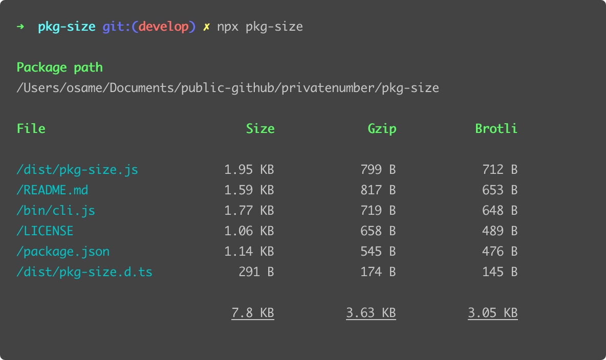

<p align="center">
	<br>
	<br>
	
	<br>
	<a href="https://npm.im/pkg-size"></a>
	<a href="https://npm.im/pkg-size"></a>
	<a href="https://packagephobia.now.sh/result?p=pkg-size"></a>
	<br>
	<br>
	<i>Measure the size of your npm package distribution</i>
</p>

**⚡️ Try it in your npm package**

```sh
$ npx pkg-size
```

<sub>If you like this project, please star it & [follow me](https://github.com/privatenumber) to see what other cool projects I'm working on! ❤️</sub>

## 🙋‍♂️ Why?
- **🔍 Size analysis** Quickly determine the total size of what you're publishing to npm!
- **🔥 Same behavior as npm `pack`/`publish`** Collects publish files as specified in your `package.json`!
- **🙌 Gzip & Brotli** See how your files compress in addition to normal size!
- **🤖 Node.js API** Integrate size checks to your CI via Node.js API

## 🚀 Install
```sh
npm i pkg-size
```

## 🚦 Quick Usage
```js
const pkgSize = require('pkg-size');

// Get package size data from current working directory
const sizeData = await pkgSize();

// Get package size data from a specific package path
const sizeData = await pkgSize('/path/to/package');
```

## ⚙️ API
```ts
type FileEntry = {
    path: string;
    mode: number;
    size: number;
    sizeGzip: number;
    sizeBrotli: number;
};

type PkgSizeData = {
    pkgPath: string;
    files: FileEntry[];
};

function pkgSize(pkgPath?: string): Promise<PkgSizeData>;
```
