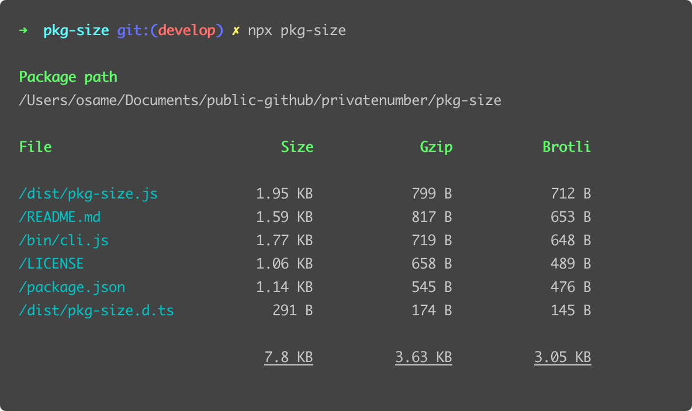

<p align="center">
	<br>
	<br>
	
	<br>
	<br>
	<a href="https://npm.im/pkg-size"></a>
	<a href="https://npm.im/pkg-size"></a>
	<a href="https://packagephobia.now.sh/result?p=pkg-size"></a>
	<br>
	<br>
	<i>Calculate the size of your npm package distribution</i>
</p>

Command-line tool to:
- Analyze the publish size of your npm package (what gets uploaded to npm)
- Measure the install size of any npm packages (including all dependencies)
- Analyze your existing `node_modules` directory

<sub>Support this project by ⭐️ starring and sharing it. [Follow me](https://github.com/privatenumber) to see what other cool projects I'm working on! ❤️</sub>

## 🚦 Quick Usage

### Analyze publish size

Curious how big your package is when published?

Analyze what will be published to npm:

```sh
pkg-size publish               # current directory
pkg-size publish ./package/path # specific path
```

**Order files by name:**
```sh
pkg-size publish --sort-by=name
```

**Show compressed sizes:**
```sh
pkg-size publish --size=gzip   # gzip compression
pkg-size publish --size=brotli # brotli compression
```

### Measure install size

Measure the install size of npm packages including all transitive dependencies.

Packages are installed in a temporary directory.

**Measure install size:**
```sh
pkg-size install lodash                        # single package
pkg-size install lodash @babel/core typescript # multiple packages
```

**Sort by:**
```sh
pkg-size install lodash --sort-by=name               # by name ascending
pkg-size install lodash --sort-by=size:desc,name:asc # by size desc, then name asc
```

**Group by:**
```sh
pkg-size install @babel/core --group-by=scope   # by npm scope (@babel, @types, etc.)
pkg-size install lodash react --group-by=license # by license type
pkg-size install lodash react --group-by=author  # by package author
```

### Analyze existing node_modules

Analyze an existing `node_modules` directory.

```sh
pkg-size analyze                  # current directory
pkg-size analyze ./path/to/project # specific path
```

Supports the same `--sort-by` and `--group-by` options as the `install` command.

## ⚙️ CLI Options

### `publish` options

#### --size \<type\>
Size type to display. Options: `raw`, `gzip`, or `brotli`. (default: `raw`)

#### -s, --sort-by \<property\>
Sort list by `name` or `size` (default: `size`)

#### -i, --ignore-files \<glob\>
Glob to ignore files from list. Total size will still include them.

#### --json
JSON output

### `install` options

#### -p, --package-manager \<manager\>
Package manager to use. Options: `npm`, `pnpm`, `yarn`. Auto-detected from `npm_config_user_agent` by default.

#### -s, --sort-by \<criteria\>
Sort by one or more properties with optional direction. Format: `property:direction` (comma-separated).

Properties: `name`, `version`, `size`, `license`, `author`, `dependencySize`, `dependencyCount`

Directions: `asc` (ascending), `desc` (descending). Default direction is `asc` when omitted.

Default: `size:desc,name:asc`

Examples:
- `--sort-by=name` - sort by name ascending
- `--sort-by=size:desc` - sort by size descending
- `--sort-by=size:desc,name:asc` - sort by size desc, then name asc for ties

#### --group-by \<type\>
Group packages by `scope`, `license`, or `author`. Scoped packages (e.g., `@babel/core`) are grouped under their organization. License and author information is extracted from package.json.

#### --json
JSON output

### `analyze` options

#### -s, --sort-by \<criteria\>
Sort by one or more properties with optional direction. Format: `property:direction` (comma-separated).

Properties: `name`, `version`, `size`, `license`, `author`, `dependencySize`, `dependencyCount`

Directions: `asc` (ascending), `desc` (descending). Default direction is `asc` when omitted.

Default: `size:desc,name:asc`

#### --group-by \<type\>
Group packages by `scope`, `license`, or `author`. Scoped packages (e.g., `@babel/core`) are grouped under their organization. License and author information is extracted from package.json.

#### --json
JSON output

### Global options

#### -h, --help
Display help message

#### --version
Display version number


## 👷‍♂️ Node.js API

### getPackageSize

Analyze the publish size of a local package:

```js
import { getPackageSize } from 'pkg-size'

// Get the package size of the current working directory
const result = await getPackageSize(process.cwd())

// With options
const resultWithOptions = await getPackageSize('/path/to/package', {
    sizes: ['size', 'gzip', 'brotli'],
    ignoreFiles: '*.map'
})
```

#### Types
```ts
type FileEntry = {
    path: string
    size: number
    sizeGzip: number
    sizeBrotli: number
}

type PackageSizeResult = {
    packagePath: string
    tarballSize: number
    files: FileEntry[]
    privatePackage: boolean
}

type PackageSizeOptions = {
    // default: ['size', 'gzip']
    sizes?: ('size' | 'gzip' | 'brotli')[]
    ignoreFiles?: string
}

function getPackageSize(
    packagePath: string,
    options?: PackageSizeOptions
): Promise<PackageSizeResult>
```

### getInstallSize

Measure the install size of npm packages (including all dependencies):

```js
import { getInstallSize } from 'pkg-size'

// Single package
const result = await getInstallSize(['lodash'])

// Multiple packages
const multiResult = await getInstallSize(['lodash', 'react', '@babel/core'])

// Also accepts space-delimited string
const stringResult = await getInstallSize('lodash react')
```

#### Types
```ts
type PackageFile = {
    path: string
    size: number
}

type InstalledPackage = {
    name: string
    version: string
    size: number
    files: PackageFile[]
    license?: string
    author?: string
}

type InstallSizeResult = {
    packages: InstalledPackage[]
    totalSize: number
    installTime: number
    packageManager: string
}

type InstallSizeOptions = {
    // auto-detected by default
    packageManager?: 'npm' | 'pnpm' | 'yarn'
    // defaults to os.tmpdir()
    tempDirectory?: string
}

function getInstallSize(
    packages: string | string[],
    options?: InstallSizeOptions
): Promise<InstallSizeResult>
```

### analyzeNodeModules

Analyze an existing `node_modules` directory:

```js
import { analyzeNodeModules } from 'pkg-size'

// Analyze current directory's node_modules
const result = await analyzeNodeModules(process.cwd())

// Analyze specific project path
const otherResult = await analyzeNodeModules('/path/to/project')
```

#### Types
```ts
type PackageFile = {
    path: string
    size: number
}

type InstalledPackage = {
    name: string
    version: string
    size: number
    files: PackageFile[]
    license?: string
    author?: string
}

type NodeModulesAnalysis = {
    packages: InstalledPackage[]
    totalSize: number
}

function analyzeNodeModules(
    projectPath: string
): Promise<NodeModulesAnalysis>
```


## 👨‍👩‍👦 Related

### [pkg-size action](https://github.com/pkg-size/action) 
A GitHub Action to automate package size regression reports on your pull requests—great for size-conscious development.
